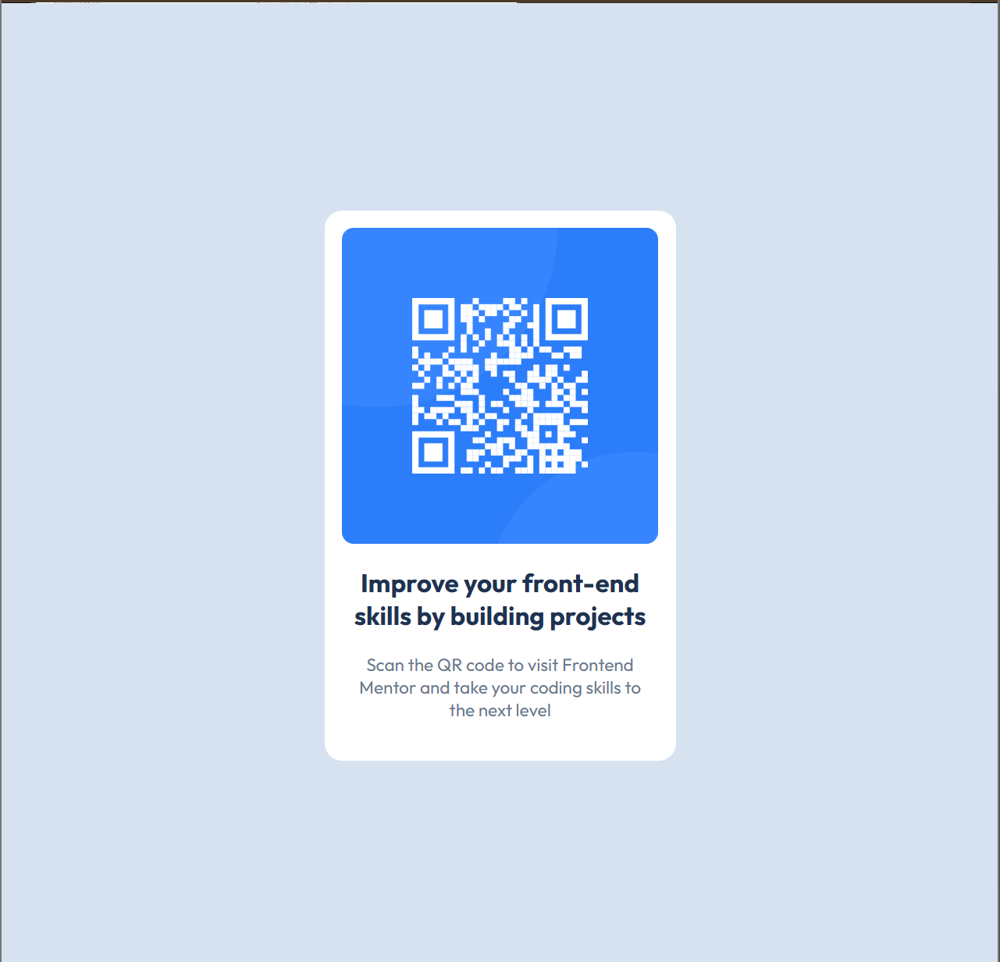

# Frontend Mentor - QR code component solution

This is a solution to the [QR code component challenge on Frontend Mentor](https://www.frontendmentor.io/challenges/qr-code-component-iux_sIO_H). Frontend Mentor challenges help you improve your coding skills by building realistic projects.

## Table of contents

- [Overview](#overview)
  - [Screenshot](#screenshot)
  - [Links](#links)
- [My process](#my-process)
  - [Built with](#built-with)
  - [What I learned](#what-i-learned)
  - [Continued development](#continued-development)
- [Author](#author)

## Overview

First FrontendMentor project. Had my web development class in college so I finally started learning. Compared to what we did in class this one was easy. Only, I'm not sure if the code I'm writing is efficient. I feel like there is room for improvement.

### Screenshot

### Links

- Solution URL: [Add solution URL here](https://your-solution-url.com)
- Live Site URL: [https://domagojboksic.github.io/]

## My process

Firstly, I analyzed the challenge and the design. Got an idea in my head and decided to try it.

My first attempt was a div container and just putting img, h2 and p elements inside and using flexbox. It worked alright but the spacing didn't feel just right.

Then I decided to wrap the h2 and p elements in another div tag so I could manipulate the spacing more freely.

Played around with that for a bit and got the result I'm happy with.

### Built with

- HTML
- CSS
- Flexbox

### What I learned

Adding height to the body tag helped me with centering a div.

### Continued development

Using proper HTML element in the right places.

Minimizing excess CSS I might be writing.

## Author

- Frontend Mentor - [@domagojboksic](https://www.frontendmentor.io/profile/domagojboksic)
